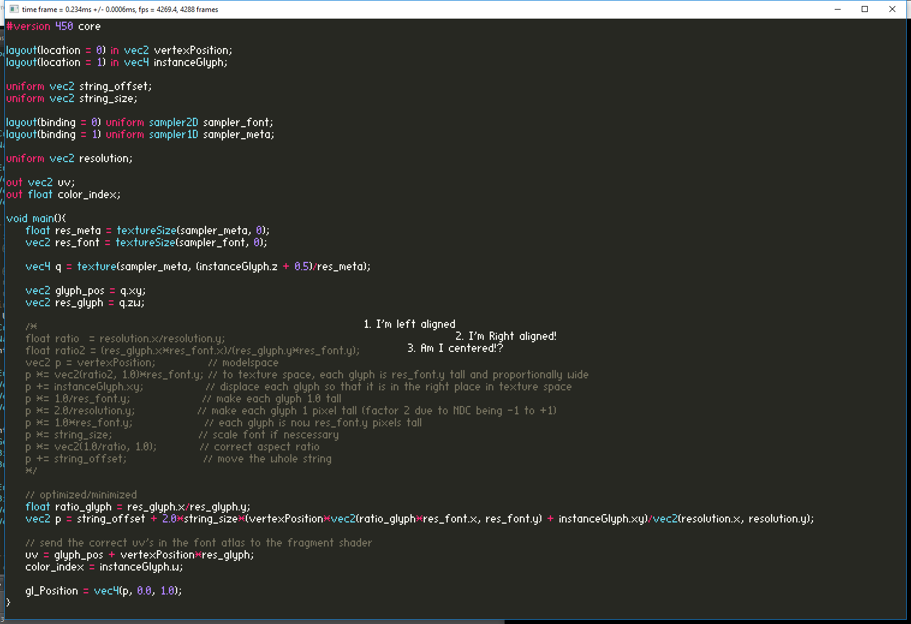

# easy_font_gl45

Simple font renderer in Opengl 4.5 using the font used by stb_easy_font.h. Uses instanced rendering, so that only position and dimensions of each glyph have to be updated isntead of each vertex. Uses DSA. 

compiles with

gcc main.c -Iinclude -lglfw3

### Screenshot

### Illustration

